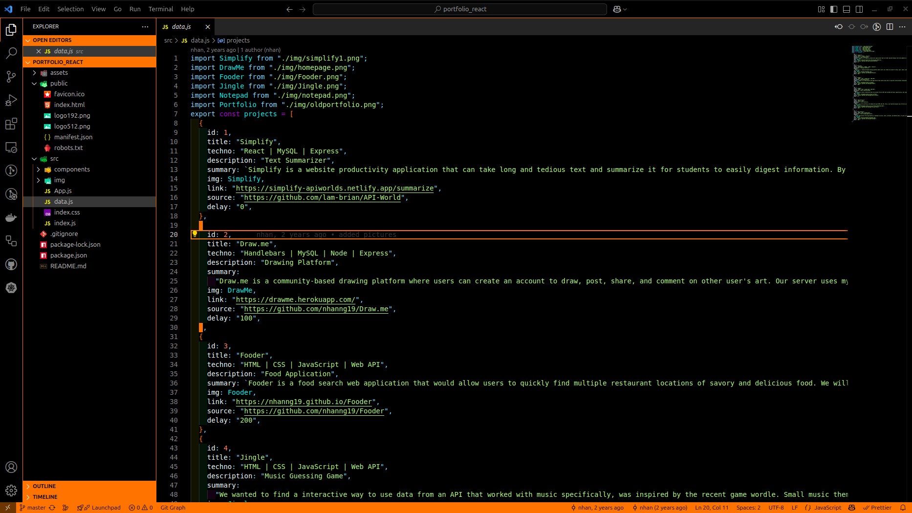

# TheDevTecHub - Eye Cooler  

*A Visual Studio Code theme crafted for comfort, clarity, and coding marathons.*

### Orange Black Theme

<!-- 

  
   
  <i>Figure: Code editor with sidebar and terminal styling</i>

 -->

Introducing **Eye Cooler**, a visually elegant and soothing theme developed by **TheDevTecHub**, thoughtfully created for developers who spend long hours in front of their screens. Our goal is simple yet essential i.e. to offer a beautiful and professional coding environment that not only looks great but also takes care of your eyes.

We’ve carefully designed a balanced color palette that minimizes eye strain while preserving crisp syntax highlighting, allowing you to stay focused and productive without fatigue. Whether you're debugging late into the night or writing code at dawn, **Eye Cooler** keeps your vision calm and your workflow seamless.

## Why Eye Cooler?

- 🌙 Gentle, eye-friendly tones for prolonged coding sessions  
- 🎨 Sleek and modern design that enhances visual appeal  
- 👁️ Optimized for readability and reduced visual fatigue  
- ⚡ Boosts productivity without compromising on comfort or elegance  

---

**Code more. Strain less.**  
With Eye Cooler, enjoy a relaxed and visually refreshing coding experience — because your eyes deserve it.

---

**Developed by:** [Devendra Dewangan](https://github.com/devendew)  
*Follow for more themes, tools, and open-source goodness!*
